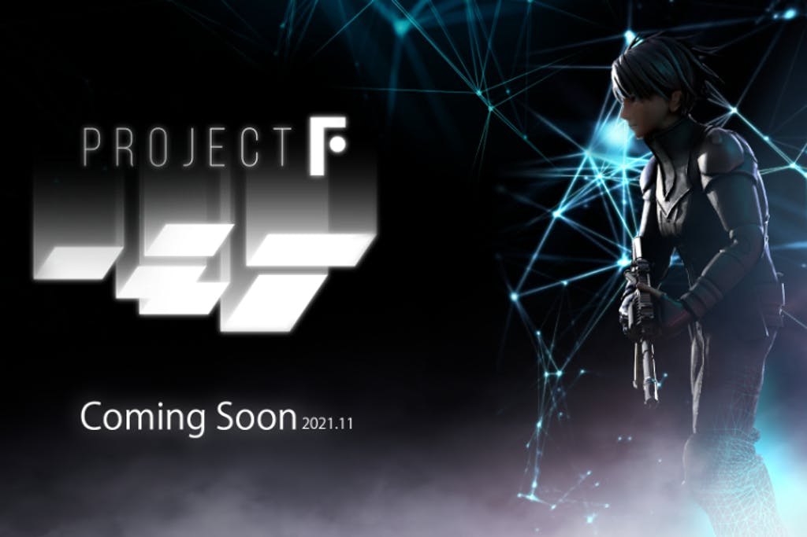
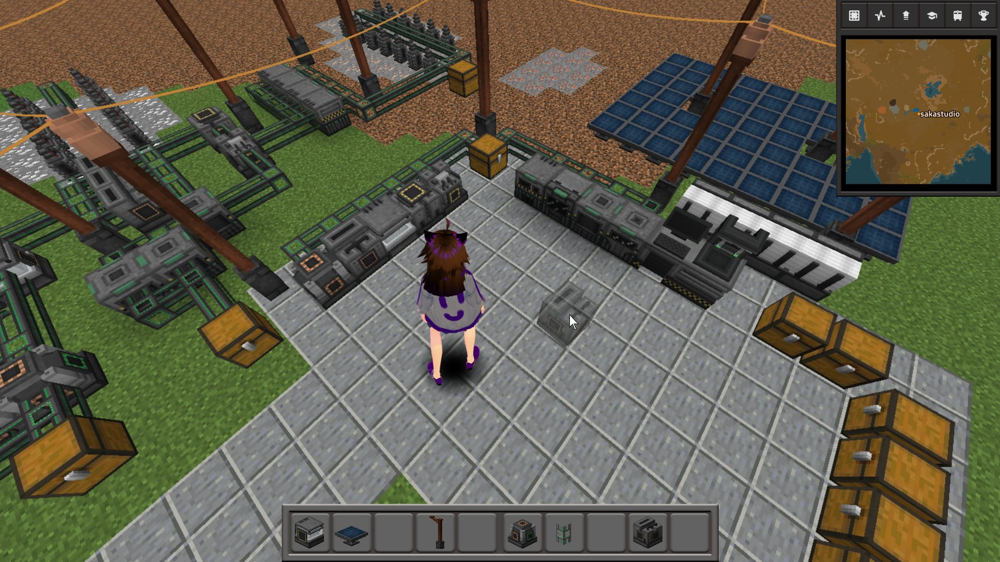

# 👋 Hi! I'm sakastudio

 
  
  
  
  
  
  

### A passionate game developer from Japan

🔭 I’m currently working on [mooorestech](https://github.com/sakastudio/industrialization)

🌱  I’m currently learning Go, DL, UE4

📫  How to reach me: sakastudio100@gmail.com or [@sakastudio_](https://twitter.com/sakastudio_)

👨‍💻  Read more about my projects at [Activities.md](https://github.com/sakastudio/sakastudio/blob/main/Activities.md) 

# 🚀 Activities

## FPS game "QUICAL"
I developed this game all by myself in a year and a half.
I released this game at February 23, 2021.

  

## FPS game "ProjectF"
We are developing a game that is being produced by [Mr.Kenki](https://twitter.com/T_kenki).

  

## moorestech

I am developing factory game like Factorio or Satisfactory.
The client is not developed. This image is concept art.

  

## Minecraft mod and plugin
I develop Minecraft mod and plugin used for Youtubers movie.

[https://github.com/TeamKun/NicoChat](https://github.com/TeamKun/NicoChat) 
[https://github.com/TeamKun/DOMINATORmod](https://github.com/TeamKun/DOMINATORmod)

### [and more](https://github.com/sakastudio/sakastudio/blob/main/Activities.md) 

# 🛠️  Languages and Tools

        
         
        
        
        
        
         
        
        
        
        
    

# 📊 Stats

 
  
  

